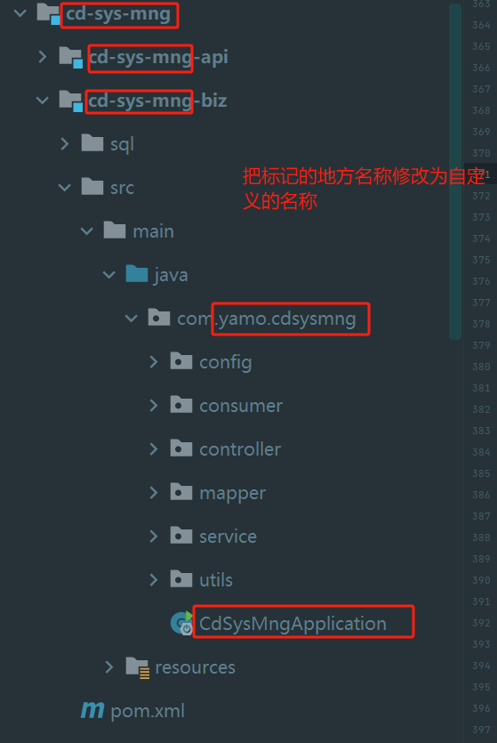
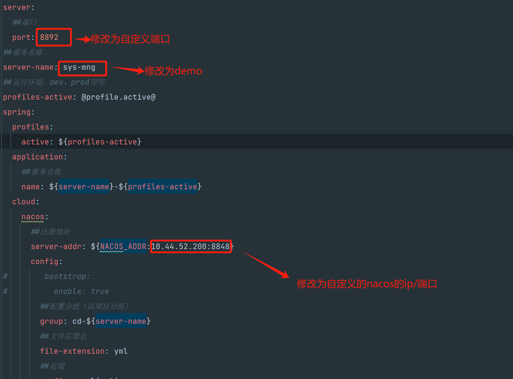
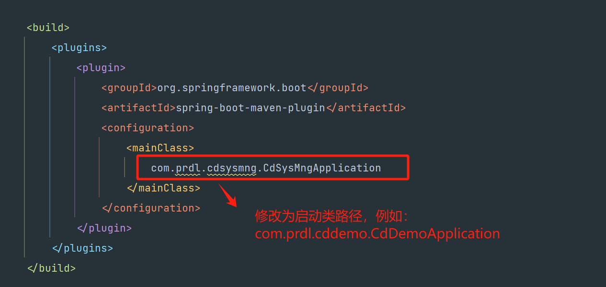
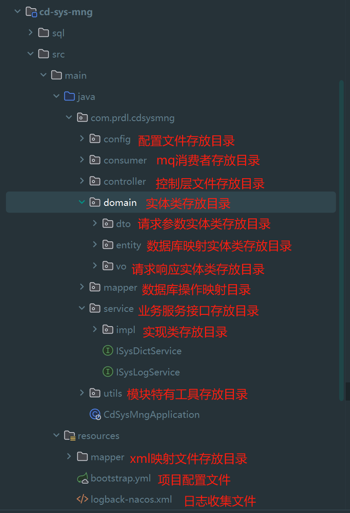
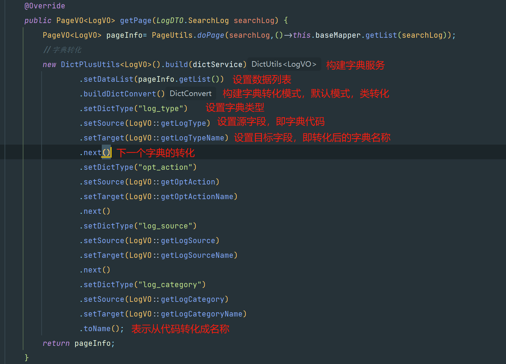
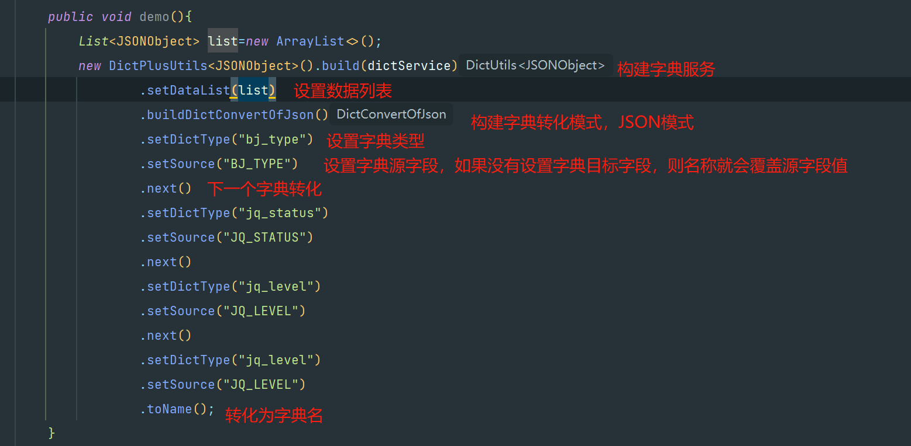

# 运行环境说明
- [ ] 运行环境，请使用**green**环境（dev和prod供给于其他系统使用）
- [ ] 在maven的setting文件中，配置上公司内网仓库

```
    <server>
      <id>yamo-nexus-release</id>
      <username>admin</username>
      <password>yamo2021</password>
    </server>
    
    <mirror>
      <id>yamo-nexus-release</id>
      <mirrorOf>*</mirrorOf>
      <url>http://10.44.51.23:17081/repository/maven-public/</url>
      <name>yamo-nexus-release</name>
    </mirror>
```

# 共同维护框架说明<br>
具有开发权限的开发人员，可以对该框架进行优化。需要修改代码，或者添加一些更好的开发工具，可以下载dev分支的代码进行修改。提交代码的时候需要标明、说明自己修改的地方，为什么要修改。提交的代码需要审核，审核通过后，便会合并分支，正式使用。

# 架构概述
本框架是为了统一公司项目后端开发的代码规范而建设，基于**SpringCloud**微服务而实现。主要目的是为了提高开发人员的工作效率、项目质量，以及缩短新人学习周期。该框架可以下载即用，已经在公司内网中安装了运行环境。请大家，按照以下介绍进行使用，按照规范进行编写自己的业务代码，彼此之间营造出一个美好的开发环境以及规范。

# 技术架构图


# 所用技术及中间件

## 技术版本
|    所用技术    |       专业名称       |    版本号     |
|:----------:|:----------------:|:----------:|
|   开发工具包    |       JDK        |    1.8     |
|   微服务框架    |   SpringCloud    |  2021.0.1  |
| Alibaba微服务 |   AlibabaCloud   | 2021.0.1.0 |
|    服务注册    |      Nacos       |  2021.0.1  |
|    服务网关    |     Gateway      |   3.1.1    |
|    服务调用    |    OpenFeign     |   3.1.1    |
|    基础框架    |    Springboot    |   2.6.4    |
|    消息队列    |     RabbitMq     |   2.6.4    |
|    缓存工具    |      Redis       |   2.6.4    |
|    搜索引擎    |  ElasticSearch   |   7.15.1   |
|   ORM框架    |   MybatisPlus    |   3.4.0    |
|  Api文档工具   | Knife4j-OpenApi2 |   4.3.0    |
|   达梦数据库    |      Dameng      | 8.1.1.193  |

## 中间件安装版本
|  组件名称   |     专业名称      |  版本号   |
|:-------:|:-------------:|:------:|
|  达梦数据库  |    Dameng     |   V8   |
| redis缓存 |     redis     | 7.2.4  |
|  消息队列   |   rabbitmq    | 3.13.0 |
|  服务注册   |     Nacos     | 2.2.1  |
|  搜索引擎   | ElasticSearch | 7.11.1 |

---

# 框架模块分工


## 公共模块【cd-common】
关于项目所有的公共类、公共方法、公共工具都放置于该模块中，该模块的子模块以*cd-common-xx*的格式来命名，例如：cd-common.
该模块包括6个子模块，分别是：cd-common-core、cd-common-elasticsearch、cd-common-mybatis、cd-common-log、cd-common-redis、cd-common-support.

## 公共服务调用api模块【cd-common-api】
- [ ] 该模块主要防止公共调用的服务api，例如：一些获取登录认证授权的接口、获取用户信息的接口
- [ ] 其他模块的服务调用模块，引入本模块，即可生效
- [ ] 引入方式如下：
```
        <!-- pom.xml引入 -->
        <dependency>
            <groupId>com.yamo</groupId>
            <artifactId>cd-common-api</artifactId>
            <scope>compile</scope>
        </dependency>
```

### 核心工具模块【cd-common-core】
- [ ] 该模块主要放置一些常用的工具，每一个业务服务都要引入此模块
- [ ] 引入方式如下：

```
        <!-- pom.xml引入 -->
        <dependency>
            <groupId>com.yamo</groupId>
            <artifactId>cd-common-core</artifactId>
            <scope>compile</scope>
        </dependency>
```

### ES工具模块【cd-common-elasticsearch】 
- [ ] es模块，es的配置以及常用es增删改查操作放置于此模块中.
- [ ] **EsUtil**类就是常用的es工具类。
- [ ] 如果业务服务需要用到es，则引入该模块
- [ ] 引入方式如下：

```
        <!-- pom.xml引入 -->
        <dependency>
            <groupId>com.yamo</groupId>
            <artifactId>cd-common-log</artifactId>
            <scope>compile</scope>
        </dependency>
```


### 系统日志模块【cd-common-log】 
- [ ] 系统日志收集，通过使用**LogMqSender**类可发送系统日志到mq中，mq中的日志会在*cd-sys-mng*服务模块中消费，存到数据库中。
- [ ] 接口调用的日志收集，可使用@***OptLog***和@***OptLogTag***注解
    - @***OptLogTag***：该注解放置于Controller类上，可对每个controller的日志分类
    - @***OptLog***：该注解放置于具体的接口方法上，收集调用接口的信息
- [ ] 例子如下图：

- [ ] 引入方式，如下：

```
        <!-- pom.xml引入 -->
        <dependency>
            <groupId>com.yamo</groupId>
            <artifactId>cd-common-log</artifactId>
            <scope>compile</scope>
        </dependency>
```

### Mybatis工具模块
- [ ] 提供分页工具、mybatis的配置以及操作数据库实体类的常用操作
- [ ] 引入方式，如下:

```
        <!-- pom.xml引入 -->
        <dependency>
            <groupId>com.yamo</groupId>
            <artifactId>cd-common-mybatis</artifactId>
            <scope>compile</scope>
        </dependency>
```

### 消息队列模块【cd-common-rabbitmq】 
- [ ] 支持多源rabbitmq，可参照*default*或*demo*的例子，实现自定义的多源消息队列
- [ ] 启用方式：在启动类上加上注解@***EnableDefaultRabbitmq***或@***EnableDemoRabbitmq***
- [ ] 业务服务模块使用rabbitmq，需要引入该模块，引入如下：

```
        <!-- pom.xml引入 -->
        <dependency>
            <groupId>com.yamo</groupId>
            <artifactId>cd-common-rabbitmq</artifactId>
            <scope>compile</scope>
        </dependency>
```

```
##application.xml引入
rabbitmq:
  default:
    host: 10.44.52.200
    port: 5672
    username: admin
    password: pr@123456
    # 发送者开启 confirm 确认机制
    publisher-confirm-type: CORRELATED
    # 发送者开启 return 确认机制
    publisher-returns: true
    listener:
      simple:
        # 设置消费端手动 ack
        acknowledge-mode: manual
        retry:
          # 是否支持重试
          enabled: true
          #60秒重试
          initial-interval: 60000
          #传递消息的最大尝试次数
          max-attempts: 3
          #尝试的最大时间间隔
          max-interval: 60000
    virtual-host: /
```

### Redis缓存工具模块
- [ ] 提供redis常用操作的工具以及配置
- [ ] 通用工具可使用**RedisUtils**
- [ ] 在这里为了方便管理，在**RedisUtils**的基础上，再次做了一次封装，实现了三种常用的抽象类，分别是：**BaseHashRedis**、**BaseStringRedis**、**BaseStringV2Redis**。目前只实现了哈希和字符串两种存储接口封装，如果需要实现其他数据存储结构，可参考这三个抽象类实现。

>  - **BaseHashRedis**：该抽象类为哈希存储类，对于哈希存储的数据，可以创建一个继承它的类，实现重写相关方法即可用，可参考**DictRedis**类
>  - **BaseStringRedis**：该抽象类为字符串存储类，对于固定键存储的数据，可实现一个继承于它的类，实现重写相关方法即可用，可参考**DemoStringRedis**类
>  - **BaseStringV2Redis**：该抽象类为字符串存储类，对于固定键存储的数据，可实现一个继承于它的类，实现重写相关方法即可用，可参考**TokenRedis**、**LoginUserRedis**类
- [ ] 实现例子如下：

```
@RequiredArgsConstructor
@Component
public class TokenRedis extends BaseStringV2Redis<String> {
    /**
     * 组键，真正的键=GROUP_KEY+输入的key
     */
    private final static String GROUP_KEY= CommonConstants.LOGIN_TOKEN;
    /**
     * 默认过期时间两个小时
     */
    private final static long DEFAULT_EXPIRE_TIME=24*60*60;
    /**
     * redis操作工具类
     */
    private final RedisUtils cacheHelper;

    @Override
    public Class<String> getObjectClass() {
        return String.class;
    }

    @Override
    public String getKey() {
        return GROUP_KEY;
    }

    @Override
    public RedisUtils getCacheHelper() {
        return cacheHelper;
    }

    @Override
    public long getExpireTime() {
        return DEFAULT_EXPIRE_TIME;
    }
}
```
- [ ] 引入方式，如下：

```
        <!-- pom.xml引入 -->
        <dependency>
            <groupId>com.yamo</groupId>
            <artifactId>cd-common-redis</artifactId>
            <scope>compile</scope>
        </dependency>
```

- [ ] xml配置

```
### application-common.yml
spring:
  redis:
    database: 1
    host: 10.44.52.200
    port: 6379
    password: pr@123456
    lettuce:
      pool:
        # 连接池最大连接数（使用负值表示没有限制）
        max-active: 20
        max-idle: 20
        min-idle: 0
        max-wait: -1ms
      shutdown-timeout: 100ms
```


- [ ] <u><font color=red>重点注意</font></u><br>
如果通用（多服务或模块）的缓存对象，那么就把该对象放在<font color=#FFF033>*com.yamo.cdcommonredis.redisObject*</font>的目录下。如果是项目或模块特有的缓存对象，则放在项目下的<font color=#FFF033>*com.yamo.模块名.redisObject*</font>目录下。


### 其他支撑工具模块【cd-common-support】
- [ ] 提供一些支撑业务服务模块的工具，例如：认证校验，异常处理
- [ ] 统一异常处理，需要在启动类上加上@***EnableyamoControllerResponse***注解
- [ ] 统一响应体处理，需要在启动类上加上@***EnableyamoControllerResponse***注解
- [ ] api接口认证处理，需要在启动类上添加@***EnableAuth***注解。使用@***Auth***注解，放置于controller层的mapping方法上即可生效，例子如下：


- [ ] <u><font color=red>重点注意</font></u><br>只有使用@***Auth***注解的情况下，才可以通过**RequestUtils**工具获取用户信息

# 服务网关讲解
Gateway网关，使用Ribbon来做负载均衡，继承Knife4j接口文档工具，接入统一用户认证。

## 路由设置

```
### application-gateway-route.yml

spring:
  cloud:
    #网关配置
    # 路由网关配置
    gateway:
      #      predicate:
      #        weight:
      #          enabled: false
      globalcors:
        cors-configurations:
          '[/**]':
            allowedOrigins: "*"
            allowedMethods: "*"
            allowedHeaders: "*"
        add-to-simple-url-handler-mapping: true
      # 启用了自动根据服务名建立路由
      discovery:
        locator:
          enabled: true
          lower-case-service-id: true
      routes:
        - id: sys-mng-${profiles-active}
          uri: lb://sys-mng-${profiles-active}
          predicates:
            - Path=/sys-mng-${profiles-active}/**
          filters:
            - StripPrefix=1
```

## api文档聚合设置

```
#### application-gateway-knife4j.yml

knife4j:
  gateway:
    enabled: true
    strategy: manual
    discover:
      version: swagger2
      enabled: true
    tags-sorter: order
    operations-sorter: order
    routes:
      - name: 系统管理
        # 真实子服务访问url地址-提供OpenAPI的文档
        url: /sys-mng-${profiles-active}/v2/api-docs?group=default
        service-name: sys-mng-${profiles-active}
        # 路由前缀
        # 兼容OpenAPI3规范在聚合时丢失contextPath属性的异常情况，由开发者自己配置contextPath,Knife4j的前端Ui做兼容处理,与url属性独立不冲突，仅OpenAPI3规范聚合需要，OpenAPI2规范不需要设置此属性,默认为(apiPathPrefix)
        context-path: /
        order: 1
```

## 统一用户中心接入使用
接入统一用户中心认证，只需要修改以下配置项，分别是*client-id、client-secret、introspection-uri*

```
### application.yml
spring:
  ##统一用户认证（鉴权）
  security:
    oauth2:
      resource-server:
        opaque-token:
          ##客户端ID
          client-id: gh_yzt
          ##秘钥
          client-secret: zcie5u56n4na7l7bjhbddg7i89foif92u0506b271wr7ktdj1ui84baad2dhxc2z
          ##自省URI
          introspection-uri: http://68.32.32.140:30001/oauth/check_token
```


# 微服务模块使用详解
微服务模块主要由三个模块组成：服务调用模块【api】、业务处理模块【biz】、实体类模块【model】


## 新建模块
新建一个微服务模块（例如*cd-demo*模块），可按照一下步骤进行创建，步骤如下：
1. 克隆*cd-sys-mng*该模块
2. 修改对应的文件名，如下图所示：

3. 删除无关文件。除了*config*和*utils*目录下的文件，以及*bootstrap.yml*和*logback-nacos.xml*文件，其他无关的文件的都可删除
4. 修改*bootstrap.xml*文件，修改如下：

5. *pom.xml*修改

6. 在nacos上克隆一份*cd-sys-mng*组的*application.xml*文件，作为*cd-demo*模块的配置文件，并且分组需要改为cd-demo。配置文件信息如下：

```
spring:
  datasource:
    dynamic:
      primary: master
      datasource:
        master:
          type: com.zaxxer.hikari.HikariDataSource
          driver-class-name: dm.jdbc.driver.DmDriver
          url: jdbc:dm://10.44.52.200:5236?schema=SYS_MNG&zeroDateTimeBehavior=convertToNull&useUnicode=true&characterEncoding=utf-8
          username: SYS_MNG
          password: pr@123456
          hikari:
            min-idle: 5
            idle-timeout: 600000
            max-pool-size: 20
            is-auto-commit: true
            pool-name: HikariCP
            max-lifetime: 1800000
            connection-timeout: 30000
            connection-test-query: SELECT 1 From dual
##rabbitmq配置
rabbitmq:
  default:
    host: 10.44.52.200
    port: 5672
    username: admin
    password: pr@123456
    # 发送者开启 confirm 确认机制
    publisher-confirm-type: CORRELATED
    # 发送者开启 return 确认机制
    publisher-returns: true
    listener:
      simple:
        # 设置消费端手动 ack
        acknowledge-mode: manual
        retry:
          # 是否支持重试
          enabled: true
          #60秒重试
          initial-interval: 60000
          #传递消息的最大尝试次数
          max-attempts: 3
          #尝试的最大时间间隔
          max-interval: 60000
    virtual-host: /
    
###mybatisplus配置
mybatis-plus:
  type-aliases-package: com.yamo.cdsysmng.domain
  mapper-locations: classpath:mapper/*.xml
  typeEnumsPackage: com.yamo.cdsysmng.common.constant
  global-config:
    db-config:
      logic-delete-field: isDelete  # 全局逻辑删除的实体字段名(since 3.3.0,配置后可以忽略不配置步骤2)
      logic-delete-value: 1 # 逻辑已删除值(默认为 1)
      logic-not-delete-value: 0 # 逻辑未删除值(默认为 0)
      insert-strategy: not_empty
      update-strategy: ignored
#  configuration:
#    log-impl: org.apache.ibatis.logging.stdout.StdOutImpl

###api文档配置
knife4j:
  enable: true
  openapi:
    title: 系统管理
    description: "系统管理"
    email:
    concat: 开发人员
    version: v4.0
    license: Apache 2.0
    group:
      api:
        group-name: default
        api-rule: package
        api-rule-resources:
          - com.yamo.cdsysmng.controller
    production: false
    setting:
      enable-debug: true
    cors: true

###es配置
elasticsearch:
  hosts: 10.44.52.202
  #hosts: 68.32.91.171
  port: 9200
  schema: http
  connectTimeOut: -1
  socketTimeOut: -1
  connectionRequestTimeOut: -1
  maxConnectNum: 100
  maxConnectPerRoute: 100

### mybatisplus的sql日志
logging:
    level:
      com.yamo.cdsysmng.mapper: debug

###elk日志配置 如果没用到elk 可注释掉
# logging:
#   config: classpath:logback-nacos.xml
# logstash:
#   ip: 68.32.32.136
#   input-port: 50482

```


## 模块文件结构如下


## 请求参数DTO编写规范
- [ ] DTO以接口的形式实现，在接口中创建真正的请求参数实体类
- [ ] DTO、VO中的在每一个类上加上@***ApiModel***注解，描述清楚该类的作用。同时，每一个参数都应该添加上@***ApiModelProperty***注解，描述清楚该参数的作用以及使用。
- [ ] Entity需要符合mmybatis-plus的规范
- [ ] DTO可以使用*springboot2 validation*的工具

|           组件名称            |                       专业名称                        |
|:-------------------------:|:-------------------------------------------------:|
|        @AssertTrue        |              	用于boolean字段，该字段只能为true              |
|        @AssertTrue        |              	用于boolean字段，该字段只能为true              |
|       @AssertFalse        |             	用于boolean字段，该字段只能为false              |
|     @CreditCardNumber     |                  	对信用卡号进行一个大致的验证                  |
|        @DecimalMax        |                    	只能小于或等于该值                     |
|        @DecimalMin        |                    	只能大于或等于该值                     |
|          @Email           |                	检查是否是一个有效的email地址                 |
|          @Future          |                	检查该字段的日期是否是属于将来的日期                |
|    @Length(min=,max=)     |          	检查所属的字段的长度是否在min和max之间,只能用于字符串          |
|           @Max            |                  	该字段的值只能小于或等于该值                  |
|           @Min            |                  	该字段的值只能大于或等于该值                  |
|         @NotNull          |                     	不能为null                      |
|         @NotBlank         |                  	不能为空，检查时会将空格忽略                  |
|         @NotEmpty         |                 	不能为空，这里的空是指空字符串                  |
|     @Pattern(regex=)      |                	被注释的元素必须符合指定的正则表达式                |
| @URL(protocol=,host,port) | 	检查是否是一个有效的URL，如果提供了protocol,host等，则该URL还需满足提供的条件 |


- [ ] 使用例子如下：

```
public interface DictDTO {
    @Data
    @ApiModel(description = "添加字典")
    class AddDict {
        /**
         * 父Id
         */
        @ApiModelProperty("父Id")
        private String parentId;

        /**
         * 字典代码
         */
        @ApiModelProperty("字典代码")
        @NotBlank(message = "字典代码不能为空")
        private String dictCode;

        /**
         * 字典名称
         */
        @ApiModelProperty("字典名称")
        @NotBlank(message = "字典名称不能为空")
        private String dictName;

        /**
         * 备注
         */
        @ApiModelProperty("备注")
        private String remark;

        /**
         * 排序
         */
        @ApiModelProperty("排序")
        @NotNull(message = "排序不能为空")
        private Integer sort;

        /**
         * 是否启用
         */
        @ApiModelProperty("是否启用")
        @NotNull(message = "是否启用不能为空")
        private String isEnable;
        @ApiModelProperty("值1")
        private String value1;
        @ApiModelProperty("值2")
        private String value2;
        @ApiModelProperty("值3")
        private String value3;
    }
}
```

- [ ] <u><font color=red>重点注意</font></u><br>

DTO、VO、Entity不要、不要、不要混在一起用（切勿把一个实体类当做DTO、VO、Entity一起用），要把他们分离出来，如果还有一些业务性的实体类，可以新建BO、pojo等等区别。

## 分页统一处理
- [ ] 分页统一使用***PageUtil.doPage(PageDTO,IService)***方法进行处理
- [ ] 例子如下:

```
    @Override
    public PageVO<DictVO> getDictPage(DictDTO.SearchDictPage searchDictPage) {
        DictDTO.SearchDict searchDict=BeanUtil.toBean(searchDictPage,DictDTO.SearchDict.class);
        //分页参数
        PageDTO pageDTO=searchDictPage;
        return PageUtils.doPage(pageDTO,()->this.baseMapper.getDictList(searchDict));
    }
```

## 字典回显统一处理工具
- [ ] 该工具主要是为了代码解耦以及方便调用所做的。建议所用到的字典，需要回显都通过该工具做处理
- [ ] 适用于具体的实体类和JSONObject转化，以及多个字典属性的转化
- [ ] 实体类模式转化的例子，如下：

- [ ] JSON模式转化的例子，如下：


## 运行环境切换


# Nacos使用规范

## bootstrap整合Nacos的配置

```
####### bootstrap.xml
server:
  ##端口
  port: 8892
##服务名称
server-name: sys-mng
##运行环境，dev、prod等等
profiles-active: @profile.active@
spring:
  profiles:
    active: ${profiles-active}
  application:
    ##服务名称
    name: ${server-name}-${profiles-active}
  cloud:
    nacos:
      ##注册地址
      server-addr: ${NACOS_ADDR:10.44.52.200:8848}
      config:
#        bootstrap:
#          enable: true
        ##配置分组（以项目分组）
        group: cd-${server-name}
        ##文件后缀名
        file-extension: yml
        ##前缀
        prefix: application
        ##命名空间（以运行环境区分：测试环境、正式环境）
        namespace: ${profiles-active}
        ##是否启用自动刷新
        refresh-enabled: true
        ##拓展配置（公共配置文件）
        extension-configs:
          ##拓展配置文件
          - data-id: application-feign.yml
            #所属分组
            group: cd-api
            ##是否刷新
            refresh: true
          - data-id: application-common.yml
            #所属分组
            group: cd-common
            ##是否刷新
            refresh: true
      ##服务发现配置
      discovery:
        ##命名空间
        namespace: ${profiles-active}
        ##固定分组
        group: yamo
```

## 命名空间
- [ ] 必须设置dev（测试环境）、prod（生产环境）命名空间作为分类，其他特有的命名空间可自定义
- [ ] 命名空间Id必须与运行环境*profiles.active*一致，因为bootstrap.yml文件已经规范化，不一致会影响正常运行
- [ ] 效果如下图：


## 配置列表
- [ ] 分组统一以服务名称命名
- [ ] 一般的项目配置文件都以***application.yml***命名，以服务名称分组，例如：application.yml(分组为cd-gateway)、application.yml(分组为cd-sys-mng).
- [ ] 必须按照规范设置，因为bootstrap.yml文件已经规范化，不一致会影响正常运行
- [ ] 效果图如下：


---

# 其他规范

## Bean注入统一方式
Bean注入方式，统一使用注解@***RequiredArgsConstructor***，~~丢弃以前使用的注解，例如：@***Autowired***、@***Resource***等等~~
## 统一异常处理
- [ ] 抛出异常统一使用**BizException**
- [ ] 不要在方法上直接抛出异常，应当使用try catch捕捉后，进行处理，可以通过使用**BizException**
- [ ] 使用如下：

```
        if (parentDict == null) {
            throw new BizException("父节点不存在");
        }
        //返回响应状态码异常
        throw new BizException(ResultCode.BUSY);
```
## 统一响应返回处理
- [ ] 统一返回数据工具，请使用**ResultVO**，成功返回使用***ResultVO.ok()***,失败返回使用***ResultVO.failed()***
- [ ] 响应状态码配置，***ResultCode***类中，编写自己的业务响应码
- [ ] 使用如下：


## Controller层编写规范
- [ ] 在编写controller类中，不允许把业务代码放置于此，一般来说，在该类中，一个mapping方法体内不超过两行代码。
- [ ] 一般需要在controller类上添加四个注解，如下所示：

```
@Api(tags = "字典管理") //api文档
@RestController
@RequestMapping("/dict")
@RequiredArgsConstructor //构造器注入注解
```
- [ ] 一般需要在mapping方法上添加两个注解，如下所示

```
@ApiOperation("批量添加字典") //api接口备注
@PostMapping("addDictList")
```
- [ ] 使用如下


## 统一JSON操作工具
对于项目中所需要做json转化和bean转化的处理，统一使用hutool的工具来处理。